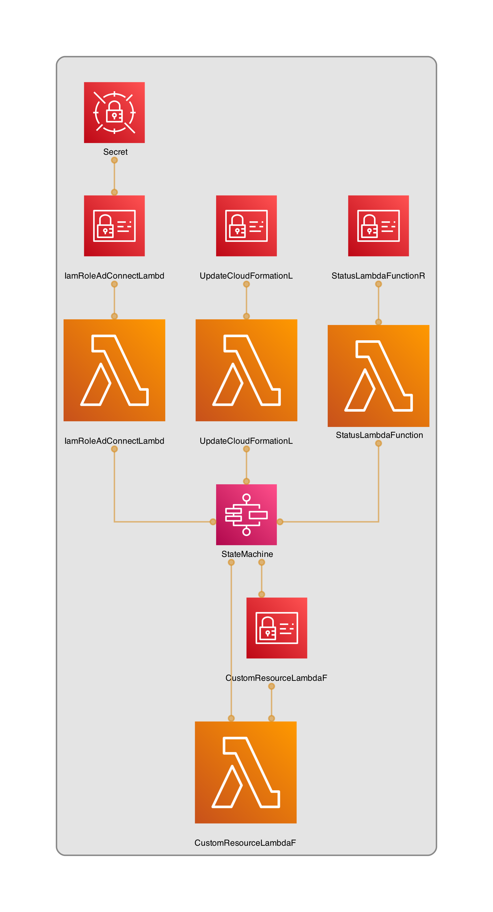
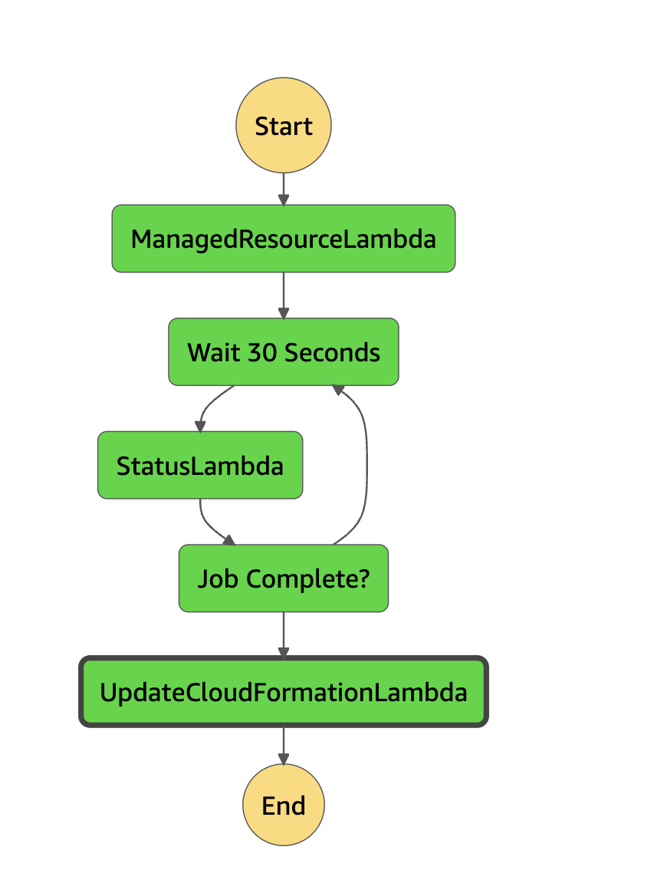

# AWS AD-Connector

[](https://docs.aws.amazon.com/cdk/v2/guide/home.html)
[](https://docs.aws.amazon.com/cdk/v2/guide/home.html)

## Description
Deploy a StepFunction to create a [Active Directory Connector](https://docs.aws.amazon.com/de_de/directoryservice/latest/admin-guide/directory_ad_connector.html).
The service user password must be passed via encrypted KMS parameters.

####  Example KMS Encryption

```
echo 'YOURPASSWORD' | base64 #SingleQuotes

aws kms encrypt --key-id KMSKEYID --plaintext  ENCODEDVALUE --query CiphertextBlob --output text
```

### Architecture


#### StepFunction Flow


| Author's |
|--------|
| David Krohn </br> [Linkedin](https://www.linkedin.com/in/daknhh/) - [Blog](https://dakn.ml)|
| Marcell Jobs </br> [Linkedin](https://www.linkedin.com/in/marcell-jobs-97b60b6a/)|

## Deployment

Provisioning is done via Taskfile and deployed to the account via a stack.

### Prerequisites

- [AWS CLI](https://aws.amazon.com/de/cli/) is installed and configured
- [awsume](https://awsu.me/) is installed
- [Taskfile](https://taskfile.dev/) is installed
- [AWS CDK](https://docs.aws.amazon.com/cdk/v2/guide/getting_started.html) is installed

### Automated provisioning with a Taskfile
1. Adjust values in exmaple.json or create a new one
2. Open Shell
3. Run: `awsume DEPLOYMENTACCOUNT`
4. Run: `task deploy`
